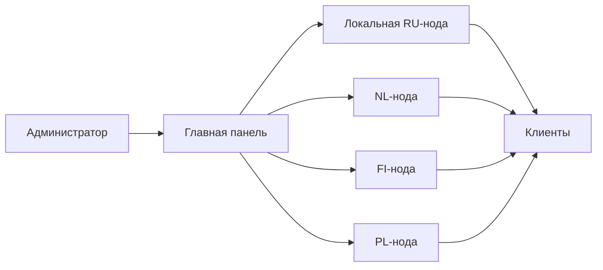

# Обзор XConnect AWG Panel

XConnect AWG Panel — панель управления доступом к AmneziaWG 2.0. Она объединяет пользователей, устройства, серверы и клиентские конфигурации в одном интерфейсе.

Руководство рассчитано на владельца сервиса и администраторов, которые устанавливают панель, подключают VPN-ноды и выдают доступ клиентам.

## Основные возможности

- создание пользователей и устройств;
- срок действия подписки с датой и временем по Москве;
- лимиты устройств и трафика;
- статусы active, expired и blocked;
- выдача .conf, vpn:// и QR-кодов для AmneziaWG 2.0;
- публичная страница подписки без отдельного логина;
- роли owner, admin и seller;
- работа с одной или несколькими VPN-нодами;
- импорт существующих пользователей с нод;
- брендинг клиентской страницы и конфигураций;
- резервное копирование базы и локального AWG-конфига;
- HTTP API для админки, портала подписки и связи между нодами.

## Варианты развёртывания

### Один сервер

Панель и AmneziaWG работают на одном сервере. Это самый простой вариант для одного региона: панель управляет локальным AWG-контейнером напрямую.

### Главный сервер и ноды

Администраторы работают в одной главной панели, а VPN-серверы расположены в разных странах. На каждой ноде запущены AmneziaWG и agent API. Главная панель создаёт пользователей и устройства на выбранных нодах.

## Как панель ограничивает доступ

Peer остаётся активным, только если пользователь имеет статус active, срок подписки не истёк и лимит трафика не превышен. При блокировке или истечении срока панель убирает peer из активного AWG-конфига.

- device_limit = 0 — количество устройств не ограничено;
- traffic_limit_gb = 0 — трафик не ограничен;
- трафик считается как сумма rx_bytes + tx_bytes;
- одно логическое устройство может иметь peer на нескольких нодах.

## Куда идти дальше

1. Откройте «Быстрый старт», если панель уже установлена.
2. Выберите схему в разделе «Установка».
3. После запуска создайте пользователя и проверьте клиентское подключение.
4. Для интеграций используйте раздел «API».

Панель не устанавливает AmneziaWG 2.0, не настраивает HTTPS и не собирает AWG-конфиги удалённых нод в один общий бэкап. Админское API использует cookie-сессию; отдельные bearer-токены для внешних админских интеграций не предусмотрены.
